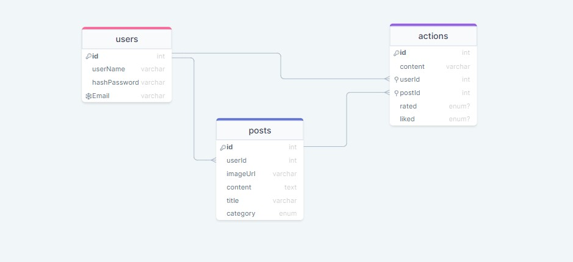

# Craft
## Description :
Craft is a social network for posting photos. Kraft's working principle is a little different from other social media. Each Kraft subscriber can post pictures and write comments on other people’s photos. Anyone can view the posts without subscribing to the site, while only subscribers can write comments and vote on the post. This site makes it easy for people to share their work, products, projects, or even their ideas.
## Live Page :
- [LIVE LINK](https://craft4you.herokuapp.com/ )
- [ER Diagram](https://drawsql.app/teams/wd-1/diagrams/craft)
---

## User Story :
- User can sign up and login.
- User can view their own profiles as well as any other person's profiles
- User don't need to be logged in to view the website, however you need to be logged in to post, comment, upvote...etc.
- User should see all posts on the home page, ranked in descending order by votes
- User should be able to click on a "Create Post" button and see a modal to create a new Post
- User should be able delete thier own posts.
- User should be able to create a comment on a Post

## User journey :
when the user opens the website shows all classes with details of these classes like price and coach and image.to choose his class, he must be login into the website. when I go the view classes page shows all the classes.
when I finish subscribing to classes I can log out. 

---

## Installation :
- If you're a git user :
    in you terminal type : `git clone https://github.com/CA-G12/Fit-life.git `
    then : `cd Fit-life.git`
- If you're not a git user :
  - Click on the 'Code' green button on the right.
  - Click on 'Download ZIP'.
  - You will have the project as ZIP file.
  - Extract the files.

---
## sql ER Diagram :

## Technologies ⚙:
- HTML5
- CSS3
- JS
- NODE.JS
- NPM PACKAGES : Jest , Supertest , Eslint , Node-fetch , express , nodemon , cross-env , pg , faker-js
- JSON files
- GIt & Github
- Heroku